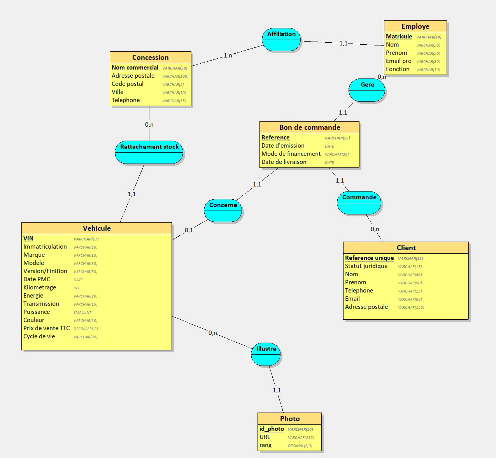
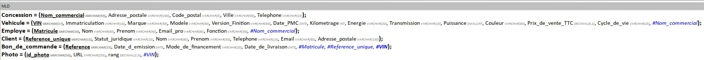

# Miniprojet 1 - Conception de Base de Données (MERISE)

## Contexte & Cahier des charges

### Prompt initial
> Tu travailles dans le domaine de la distribution automobile et de la vente de véhicules d'occasion (VO) reconditionnés multimarques. Ton entreprise a comme activité de racheter, reconditionner, exposer et vendre des véhicules d'occasion à des particuliers ou à des professionnels, à travers un réseau de concessions physiques et une vitrine digitale. C’est une entreprise comme Autosphere, Aramisauto ou Autohero. Des données ont été collectées sur les véhicules en stock (caractéristiques, état, visuels et cycle de vie), les points de vente physiques, le personnel commercial et administratif, ainsi que les clients acheteurs et les actes de vente. Inspire-toi du site web et du réseau de concessions du groupe Autosphere (autosphere.fr).
>
> Ton entreprise veut appliquer MERISE pour concevoir un système d'information. Tu es chargé de la partie analyse, c’est-à-dire de collecter les besoins auprès de l’entreprise. Elle a fait appel à un étudiant en ingénierie informatique pour réaliser ce projet, tu dois lui fournir les informations nécessaires pour qu’il applique ensuite lui-même les étapes suivantes de conception et développement de la base de données.
>
> D’abord, établis les règles de gestion des données de ton entreprise, sous la forme d'une liste à puces. Elle doit correspondre aux informations que fournit quelqu’un qui connaît le fonctionnement de l’entreprise, mais pas comment se construit un système d’information.
>
> Ensuite, à partir de ces règles, fournis un dictionnaire de données brutes avec les colonnes suivantes, regroupées dans un tableau : signification de la donnée, type, taille en nombre de caractères ou de chiffres. Il doit y avoir entre 25 et 35 données. Il sert à fournir des informations supplémentaires sur chaque donnée (taille et type) mais sans a priori sur comment les données vont être modélisées ensuite.


> [!IMPORTANT]
> Nous ne sommes en aucun cas affilié aux marques que nous citons dans notre projet.
> Autosphere, Aramisauto et Autohero sont des marques déposées qui appartiennent a leurs propriétaires respectifs. 


---

### 1. Règles de gestion (Métier)

* Chaque véhicule d'occasion qui entre dans notre réseau possède un numéro de série unique au monde (numéro de châssis / VIN) et une plaque d'immatriculation.
* Pour chaque véhicule, on renseigne ses informations techniques et commerciales : la marque, le modèle, la version ou finition précise, l'année de première immatriculation, la couleur, le type d'énergie (essence, diesel, hybride, 100 % électrique), le type de transmission (boîte manuelle ou automatique) et la puissance fiscale en chevaux fiscaux.
* Le kilométrage réel affiché au compteur est relevé et certifié à l'entrée du véhicule dans notre parc.
* Chaque véhicule possède un prix de vente affiché toutes taxes comprises (TTC), non négociable sur la vitrine digitale.
* Un véhicule traverse plusieurs étapes dans son cycle de vie ; il a donc un statut opérationnel précis à tout moment (ex. : *En arrivage*, *En reconditionnement atelier*, *En stock / En ligne*, *Réservé*, *Vendu*, *Livré*).
* Pour alimenter le catalogue en ligne (vitrine web à la façon d'Autosphere), plusieurs photographies numériques sont prises pour chaque véhicule une fois son reconditionnement terminé. Chaque photo dispose d'un lien d'accès et d'un rang d'affichage (pour définir la vue principale de face, le profil, l'habitacle, etc.).
* À un instant donné, un véhicule en stock est rattaché physiquement à un point de vente précis (concession ou centre de reconditionnement/hub).
* Chaque concession du réseau est repérée par son nom commercial, dispose d'une adresse géographique complète (rue, code postal, ville) et d'une ligne téléphonique directe d'accueil.
* Notre personnel (conseillers commerciaux, préparateurs, secrétariat de livraison) est identifié par un matricule interne. Pour chaque collaborateur, on conserve son nom, son prénom, son adresse e-mail professionnelle ainsi que sa fonction (poste occupé).
* Chaque collaborateur est affecté administrativement à une concession principale du réseau.
* Nos clients peuvent être des particuliers ou des professionnels (sociétés, artisans). Nous enregistrons leur identité (nom ou raison sociale, prénom pour les particuliers), leurs coordonnées de contact direct (numéro de téléphone mobile/fixe, e-mail) et leur adresse postale complète.
* Lorsqu'un accord est conclu pour l'achat d'un véhicule, un bon de commande officiel est généré avec une référence unique et sa date d'établissement.
* Un bon de commande porte systématiquement sur un seul véhicule d'occasion identifié (les véhicules d'occasion étant des pièces uniques en stock).
* Chaque bon de commande est conclu avec un client unique et géré par un unique conseiller commercial référent.
* Le bon de commande précise la solution de règlement retenue (comptant, crédit classique, location avec option d'achat - LOA) ainsi que la date prévisionnelle ou confirmée de livraison au client.

---

### 2. Dictionnaire de données brutes

| Signification de la donnée | Type | Taille en nombre de caractères ou de chiffres |
| :--- | :--- | :--- |
| Numéro de châssis international du véhicule (VIN) | Alphanumérique | 17 caractères |
| Numéro d'immatriculation du véhicule | Alphanumérique | 10 caractères |
| Marque constructeur du véhicule | Alphabétique | 30 caractères |
| Modèle commercial du véhicule | Alphanumérique | 40 caractères |
| Version ou niveau de finition du véhicule | Alphanumérique | 60 caractères |
| Date de première mise en circulation | Date | 10 caractères (AAAA-MM-JJ) |
| Kilométrage certifié au compteur | Numérique (entier) | 7 chiffres |
| Énergie / Carburant principal | Alphabétique | 20 caractères |
| Type de boîte de vitesses | Alphabétique | 15 caractères |
| Puissance fiscale (en CV) | Numérique (entier) | 3 chiffres |
| Couleur de la carrosserie | Alphabétique | 30 caractères |
| Prix de vente TTC affiché | Numérique (décimal) | 9 chiffres (dont 2 décimales) |
| Statut du cycle de vie du véhicule | Alphabétique | 25 caractères |
| Lien URL de la photographie du véhicule | Alphanumérique | 255 caractères |
| Numéro d'ordre d'affichage de la photo | Numérique (entier) | 2 chiffres |
| Nom commercial de la concession | Alphanumérique | 50 caractères |
| Adresse de la concession (numéro et voie) | Alphanumérique | 100 caractères |
| Code postal de la concession | Numérique | 5 chiffres |
| Ville d'implantation de la concession | Alphabétique | 50 caractères |
| Numéro de téléphone de la concession | Alphanumérique | 15 caractères |
| Matricule interne du collaborateur | Alphanumérique | 10 caractères |
| Nom de famille du collaborateur | Alphabétique | 50 caractères |
| Prénom du collaborateur | Alphabétique | 50 caractères |
| Adresse e-mail professionnelle du collaborateur | Alphanumérique | 80 caractères |
| Fonction / Rôle du collaborateur | Alphabétique | 30 caractères |
| Référence unique du client | Alphanumérique | 12 caractères |
| Statut juridique du client (Particulier ou Professionnel) | Alphabétique | 15 caractères |
| Nom de famille ou Raison sociale du client | Alphanumérique | 80 caractères |
| Prénom du client | Alphabétique | 50 caractères |
| Numéro de téléphone de contact du client | Alphanumérique | 15 caractères |
| Adresse e-mail de contact du client | Alphanumérique | 80 caractères |
| Adresse postale complète du client | Alphanumérique | 150 caractères |
| Référence du bon de commande | Alphanumérique | 15 caractères |
| Date d'émission du bon de commande | Date | 10 caractères (AAAA-MM-JJ) |
| Mode de financement choisi | Alphabétique | 20 caractères |
| Date de livraison convenue ou effective | Date | 10 caractères (AAAA-MM-JJ) |

*(Total : 36 données élémentaires recouvrant les aspects véhicules, photos, concessions, personnel, clients et transactions).*

---

## 3. Modèle Conceptuel de Données (MCD)

Le modèle conceptuel traduit directement les règles de gestion :
* **Vehicule (0,n) --- [Illustre] --- (1,1) Photo** : un véhicule dispose d'un jeu de photographies ordonnées.
* **Concession (0,n) --- [Rattachement stock] --- (1,1) Vehicule** : chaque véhicule est localisé dans une concession précise.
* **Concession (1,n) --- [Affiliation] --- (1,1) Employe** : un employé est affecté à un point de vente.
* **Bon de commande** est modélisé sous la forme d'une **entité propre** reliée par des associations binaires :
  * `(1,1)` vers `Client` et `(0,n)` côté Client *(un bon a un seul acheteur ; un client peut commander plusieurs véhicules)*.
  * `(1,1)` vers `Employe` et `(0,n)` côté Employe *(un bon est suivi par un conseiller référent)*.
  * `(1,1)` vers `Vehicule` et `(0,1)` côté Vehicule *(un véhicule d'occasion étant unique, il est vendu 0 ou 1 fois)*.



---

## 4. Modèle Logique de Données (MLD)

### Format textuel normalisé (Merise)
* Clé primaire soulignée / en gras (`*`).
* Clé étrangère précédée d'un dièse (`#`).

| Table (Relation) | Attributs (* = Clé primaire, # = Clé étrangère) |
| :--- | :--- |
| **Concession** | **\*Nom_commercial**, Adresse_postale, Code_postal, Ville, Telephone |
| **Vehicule** | **\*VIN**, Immatriculation, Marque, Modele, Version_Finition, Date_PMC, Kilometrage, Energie, Transmission, Puissance, Couleur, Prix_de_vente_TTC, Cycle_de_vie, **#Nom_commercial** |
| **Employe** | **\*Matricule**, Nom, Prenom, Email_pro, Fonction, **#Nom_commercial** |
| **Client** | **\*Reference_unique**, Statut_juridique, Nom, Prenom, Telephone, Email, Adresse_postale |
| **Bon_de_commande** | **\*Reference**, Date_d_emission, Mode_de_financement, Date_de_livraison, **#Matricule**, **#Reference_unique**, **#VIN** |
| **Photo** | **\*id_photo**, URL, rang, **#VIN** |




---

## 5. Justification de la Forme Normale (3FN)

Le schéma relationnel produit respecte les règles de la **3ème Forme Normale (3FN)** :

1. **1ère Forme Normale (1FN) :** Tous les attributs sont atomiques (non sécables, aucune liste ou tableau dans un champ) et chaque relation possède une clé primaire identifiante claire.
2. **2ème Forme Normale (2FN) :** L'ensemble des clés primaires sont formées d'un **attribut simple unique** (`VIN`, `Nom_commercial`, `Matricule`, `Reference`, `Reference_unique`, `id_photo`). Il n'y a donc aucune dépendance fonctionnelle partielle vis-à-vis d'une clé composite.
3. **3ème Forme Normale (3FN) :** Tout attribut non-clé dépend directement de la clé primaire et d'aucun autre attribut non-clé.
   * *Note théorique :* On pourrait isoler les dépendances `Code_postal` $\rightarrow$ `Ville` ou `Modele` $\rightarrow$ `Marque` dans des tables de référence annexes, mais dans le contexte du cahier des charges d'un réseau VO multimarque, cette structure évite des jointures superflues tout en conservant une intégrité parfaite.

---

## 6. Modèle Physique de Données (MPD / LDD SQL)

cf. [scheme.sql](db/scheme.sql)

---

## 7. Jeu de données de test

cf. [test_data.sql](db/test_data.sql)  
dump de la base de données de test [link](db/dump-td-202610080919.sql)

---

## 8. Note sur le stockage de données à contraintes (Enjeux réels vs académiques)

Certains champs possèdent un nombre fini et connu de valeurs possibles, par exemple le statut du cycle de vie du véhicule (En attente, Reconditionnement atelier, En stock / En ligne, Réservé, Vendu, Livré).

Le stockage de ce type de données sous forme étendue en `VARCHAR` n'est pas la solution la plus optimisée en production logicielle. Bien que la modélisation Merise académique impose des types textuels pour refléter fidèlement le dictionnaire de données métier, une architecture logicielle moderne privilégie un identifiant compact `TINYINT` ou un code court (slug / enum) pour plusieurs raisons :

Performances et empreinte mémoire : Un entier sur 1 octet (`TINYINT`) allège considérablement la table et les index d'arbre (B-Tree), accélérant les filtres et tris SQL.
Internationalisation (i18n) et évolutivité : En cas d'expansion à l'international ou de changement de formulation par le marketing, la base de données reste inchangée : seul le mapping applicatif est adapté.
Exemple d'implémentation applicative moderne (PHP 8+) :

```php 
$lifecycleLabel = match (intval($row['Cycle_de_vie'])) {
    1 => 'En attente reconditionnement',
    2 => 'Reconditionnement atelier',
    3 => 'En stock / En ligne',
    4 => 'Réservé',
    5 => 'Vendu',
    6 => 'Livré',
    default => 'Inconnu',
};

echo "<div class='badge'>Statut : {$lifecycleLabel}</div>";
```

---

## Transparence IA 

L'IA générative a été utilisé pour les aspects suivants de ce projet : 
- Génération du prompt initial
- Génération du cahier des charges
- Générations des règles métier
- Génération du jeu de données de test
- Reformulation & mise en page de ce README


## Espace de travail utilisé

- Environnement distant : https://git.nekocorp.fr/EFREI-Projects/kasm_db_workbench
- Outils : Looping (MCD / MLD), MariaDB 10.11, DBeaver, Nekocorp, Docker.
